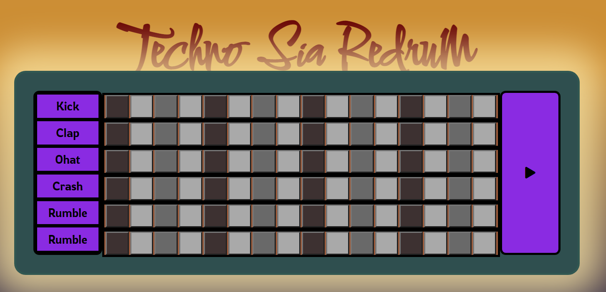

# Drum machine in web browser
Sia Redrum v1.0.0 is a  drum machine created by vanilla javascript. Sia Redrum v1.0.0 has six  different sounds that can be trigged by a 16 step sequencer at 120bpm.

## The future of a web based daw.
Today musicians has difficulties collabing between two or more locations. This is most due to mismatching of programs. 
Web based music creation or simply a web daw (**digital audio workstation**) may be the way to let the world speak music more with each other. 

## Sia's engine

Sia is based on six 128kbps mp3 samples that is triggaded by click on the sequencer. The **seq**uencer    has 16 **pos**itions 
with a time interval of 125ms per position. 
This is made by js setInterval method and can create bug-like prblems in browser.
If a sample is trigged before sample ended, it will retrigger. This and including, time interval, sequencer length etc. should be a option for the user and could come up in a newer version.   

## Validation

css - 100% checked. 
html - 100% checked.

