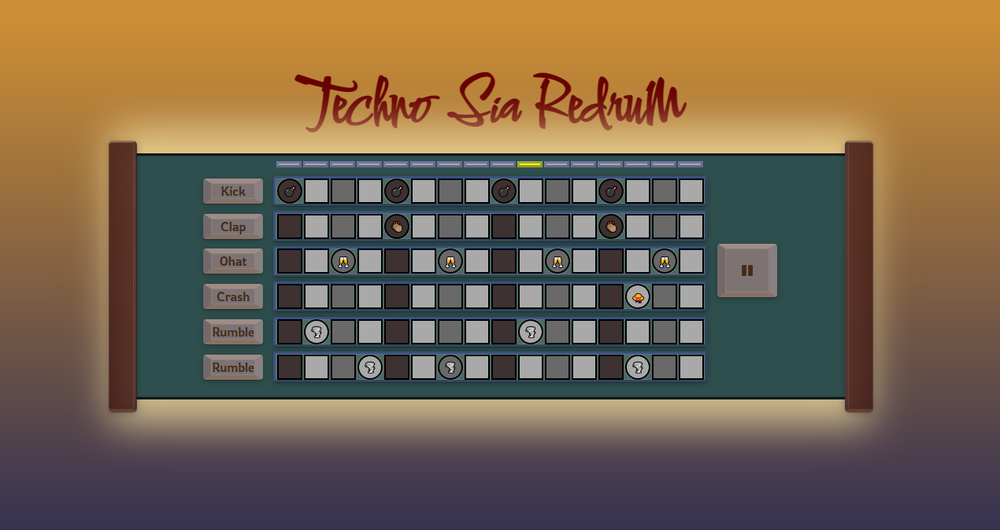
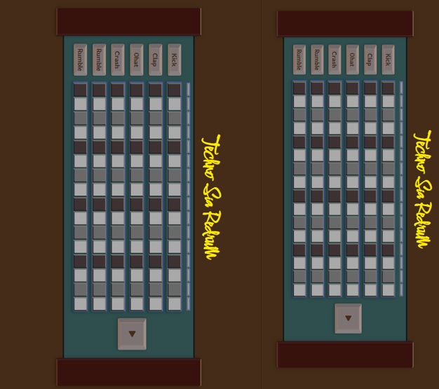
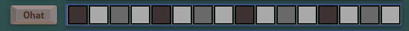
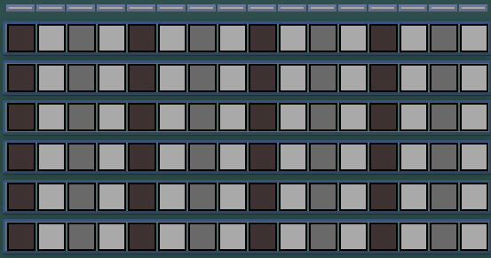
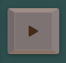
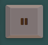

# Sia Redrum
There could never be too many drum machines in the world and maybe just maybe peace will come when everyone has a neighbor with a drum machine.
This drum machine is running in the web browser making it able to use by almost everyone. If you are a music lover you will see many more web-based music projects on this GitHub.   

### Computer view

### Tablet & Mobile view

## Features 
The drum machine has six channels of sound, four of them are drum sound, two are rumble sound, and one play/pause button.
A Rumble sound was added to make it more groove-ready. The rumble has different sounds and if one plays when the other one is trigged the first one will stop playing. This limits the rumble to get too rumbly 

You don't need to be rocket science to get sounds from this machine. Click on the sequencer where you want the sound and then press play. 
Right now it is locked to 120bpm but more features will come in later versions.

### Existing Features

- __The Channel Names__

  - Users can see the name of every channel

- __The Sequencer__

  - The sequencer is a 16-step sequencer and represents one bar. It is color indicated for visual symmetry.

- __The Play/Pause Buttom__

  - Click the play button to start the sequence
  - If the sequence is running you can pause it by pressing the pause button 

### Features Left to Implement

- sequence can play the last beat
- bpm not fixed at 120bpm
- volume not fixed
- no clipping when retriggering rumble sound
- changing the start position of the rumbling sound
- visual animations for better experiance

This and more features will be implemented in later updates. 
## Testing 
Sia Redrum can have a diffrent groove depending on the divice you run it on. Like hardware synthesizer no one a like sounds the same.
If you let the sequencer run without any sounds playing, then go to another page and then come back, then you will see the sequencer act wild for a while.
Hope you find a pattern to groove with and be inspired to dance and make music. 

### Validator Testing 

- HTML
    - No errors were returned when passing through the official [W3C validator](https://validator.w3.org/nu/?doc=https%3A%2F%2Fdrmaxpower.github.io%2Fsiaredrum%2F)
- CSS
    - No errors were found when passing through the official [(Jigsaw) validator](https://jigsaw.w3.org/css-validator/validator?uri=https%3A%2F%2Fdrmaxpower.github.io%2Fsiaredrum%2F&profile=css3svg&usermedium=all&warning=1&vextwarning=&lang=sv)
- JavaScript
    - No errors were found when passing through the official [Jshint validator](https://jshint.com/)
      - The following metrics were returned: 
      - There are 13 functions in this file.
      - Function with the largest signature take 3 arguments, while the median is 0.
      - Largest function has 27 statements in it, while the median is 1.
      - The most complex function has a cyclomatic complexity value of 10 while the median is 1.
    - One warning: 
      - Functions declared within loops referencing an outer scoped variable may lead to confusing semantics. (buttonHandler, {channel sound}Col, i)
### Unfixed Bugs

- sequence can't play the last beat 

## Deployment

- The site was deployed to GitHub pages. The steps to deploy were as follows: 
  - In the GitHub repository, navigate to the Settings tab 
  - Go to Pages
  - publish repository

The live link can be found here - https://drmaxpower.github.io/siaredrum/

### Content 

- The emojis were taken from [Emoji](https://emojipedia.org/)
- The font awesome that is used for play and pause was taken from [Font Awesome](https://kit.fontawesome.com/7298b5ab39.js/)

### Media

- The mp3 files were made by E=mpc
